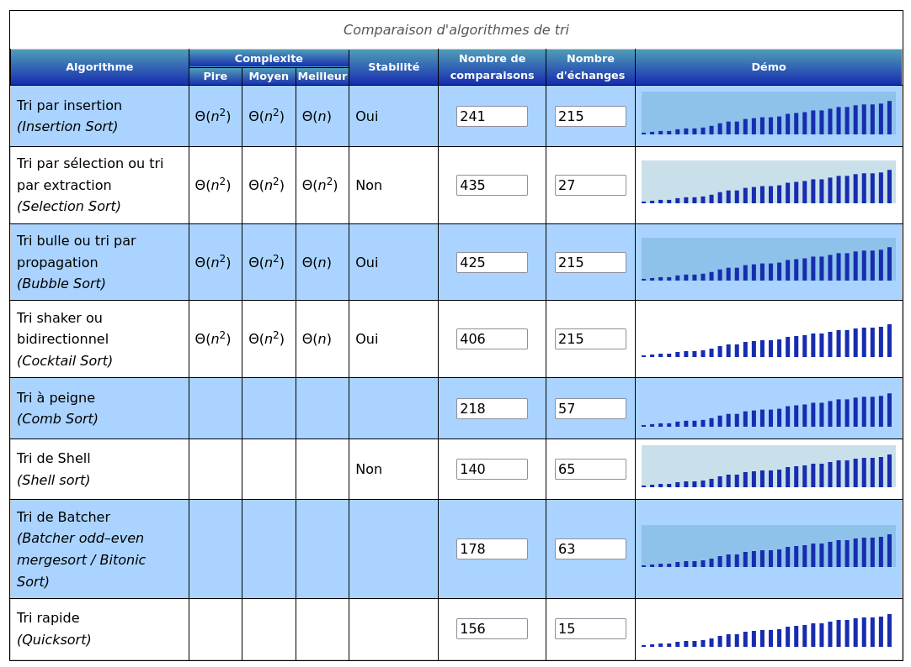

# Tri très séléctif

## Enoncé

Comme l'épreuve Tri Sélectif, vous devez trier le tableau, mais cette fois vous devez être efficace !

Note : le challenge fait suite à Tri sélectif (en introduction) où l'on doit trier un tableau sans le voir.

## Étude du code source

Côté serveur, deux fonctions peuvent être utilisées pour trier : `comparer()` et `echanger()`. La principale différence avec le premier challenge est le nombre limité de comparaison : 5 \* 32 + 27 (soit 185 pour ceux qui ont du mal à suivre).

À titre de comparaison, mon algo dégueu du premier chall en utilisait 527.

## Documentation
Pour résoudre ce challenge, il va donc falloir se renseigner sur les algorithmes de tri, sujet maintes et maintes fois traité par les codeurs, ce qui ne m'empêche pas de rien connaître au sujet. Après quelques recherches on tombe sur cette petite comparaison sympathique (pour 30 items à trier) :



*[Source](http://lwh.free.fr/pages/algo/tri/tri.htm) pour les intéressés.*

## Résolution 
On va donc se diriger vers l'algo QuickSort qui paraît le plus efficient. Quelques frappes de clavier plus tard on trouve cette [gentille page](https://marcarea.com/weblog/2019/02/06/quelques-algorithmes-de-tri-en-python) qui nous explique comment implémenter les différents algos en python. Plus qu'à réadapter ce travail mâché puis à lancer le script et on obtient notre flag.

```
def quicksort(lo=0, hi=None):

    if hi is None:
        hi = longueur()-1

    # Il nous faut au moins 2 éléments.
    if lo < hi:

        # `p` est la position du pivot dans le tableau après partition.
        p = partition(lo, hi)

        # Tri récursif des 2 parties obtenues.
        quicksort(lo, p - 1)
        quicksort(p + 1, hi)

def partition(lo, hi):

    # Choisir le dernier élément en tant que pivot.
    pivot_index = hi

    # `l` (comme less) sert à trouver la place du pivot dans le tableau.
    l = lo

    # Bien exclure `hi` lors de l'itération car c'est le pivot.
    for i in range(lo, hi):
        if comparer(i, pivot_index):
            # Les éléments plus petit que le pivot passent à gauche.
            echanger(i, l)
            l = l + 1

    # Déplacer le pivot à sa bonne position.
    echanger(l, pivot_index)

    return l
```
*Script complet [ici](./utils/client.py)*
